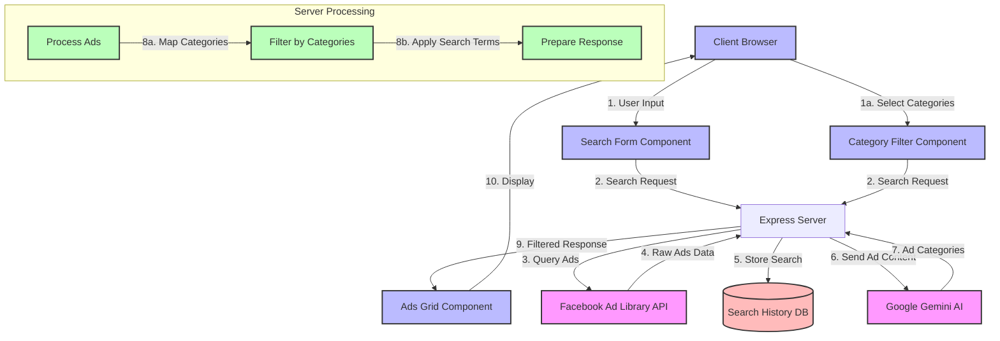

# Facebook Ad Library Architecture

## System Flow Diagram

## Flow Description

1. **User Interaction**
   - Users enter search terms and select categories in the browser
   - The UI components collect and validate user input

2. **Server Processing**
   - Express server receives search request with terms and categories
   - Queries Facebook Ad Library API for matching ads
   - Stores search history for analytics
   - Uses Gemini AI to categorize the ads
   - Filters ads based on user-selected categories

3. **Response Handling**
   - Filtered and categorized ads are sent back to client
   - AdsGrid component displays the results
   - Users can interact with individual ad cards

## Color Legend
- 🟪 Pink: External APIs (Facebook Ad Library, Gemini AI)
- 🟦 Blue: UI Components
- 🟩 Green: Processing Steps
- 🟥 Red: Data Storage
